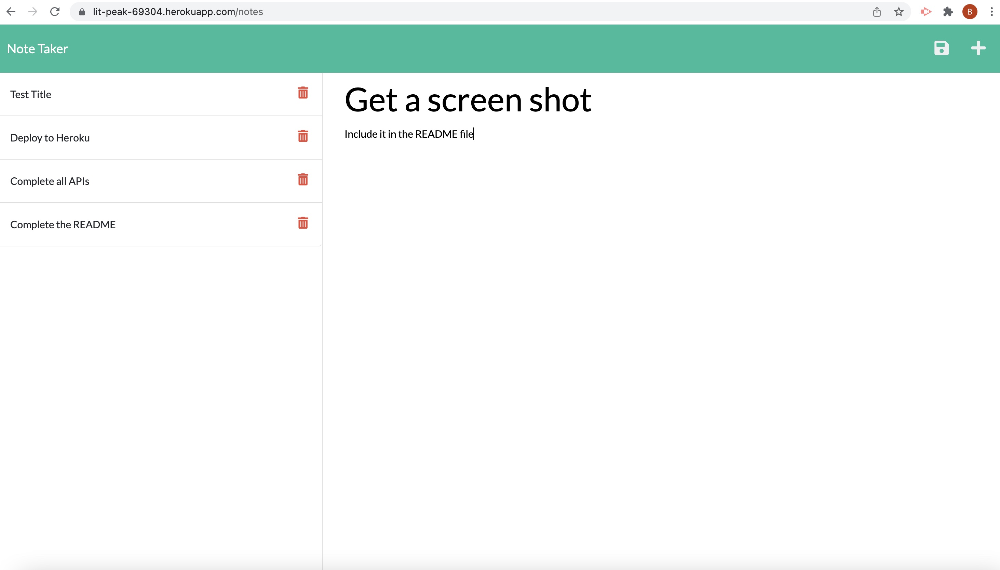

# [Welcome to Note Taker](https://github.com/bdswartz/note-taker)

#### Not Taker is an integrated front end interface to a back end server created with express.js.  The function is to take user entered notes from the front end html/javascript and keep those notes in a back end server hosted on Heroku.
---

#### Collaborators:
* [Brian Swartz](https://github.com/bdswartz)

---

## Installation
N/A

---

## Usage
Navigate to the landing page at [Note Taker](https://lit-peak-69304.herokuapp.com/)

---

## Technologies

> <b>Development Tools:</b>
  * Express.js
    * File System
    * Path
    * Router
    * uniqid - npm id generator 
  * JavaScript
  * HTML (to create application output)

  ---

## User Story
### AS A small business owner
I WANT to be able to write and save notes
SO THAT I can organize my thoughts and keep track of tasks I need to complete
    
### Acceptance Criteria for Minimum Viable Product

GIVEN a note-taking application
*  WHEN I open the Note Taker
    THEN I am presented with a landing page with a link to a notes page
*  WHEN I click on the link to the notes page
    THEN I am presented with a page with existing notes listed in the left-hand column, plus empty fields to enter a new note title and the note’s text in the right-hand column
*  WHEN I enter a new note title and the note’s text
    THEN a Save icon appears in the navigation at the top of the page
*  WHEN I click on the Save icon
    THEN the new note I have entered is saved and appears in the left-hand column with the other existing notes
*  WHEN I click on an existing note in the list in the left-hand column
    THEN that note appears in the right-hand column
*  WHEN I click on the Write icon in the navigation at the top of the page
    THEN I am presented with empty fields to enter a new note title and the note’s text in the right-hand column

---

Screen shot showing the 'save' and 'add new' notes icons in the top right corner as well as the list of notes in the left pane.  Click the red trash can to delete a note.